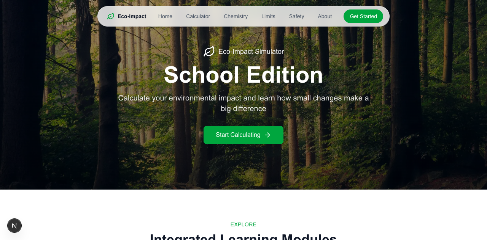
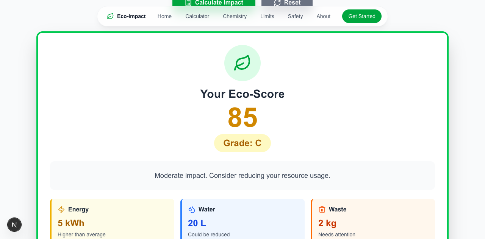
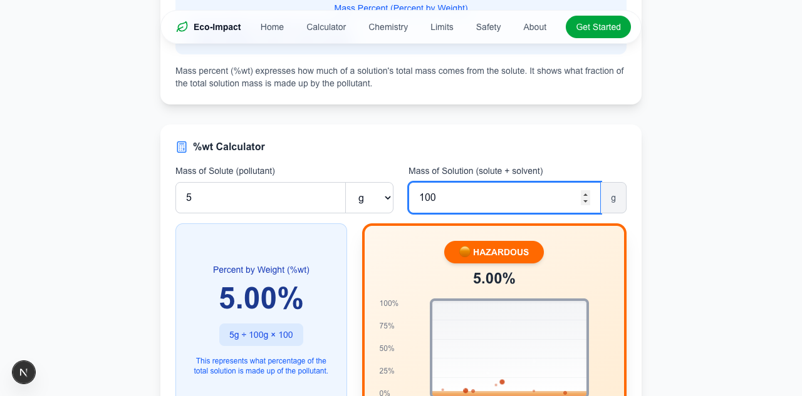
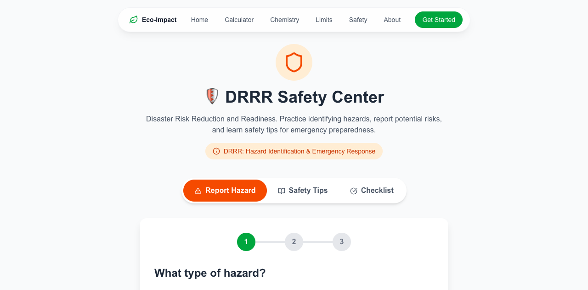

# Eco-Impact Simulator: School Edition

An interactive educational dashboard for students and school communities to explore how everyday electricity, water, and waste habits affect environmental impact.

## Preview

- **Live demo:** Not deployed yet
- **Repository:** [Eco-Impact Simulator on GitHub](https://github.com/ymadz/eco-impact-simulator)
- **Screenshots:** The verified browser captures are included in the [Screenshots](#screenshots) section below.

## Overview

Eco-Impact Simulator: School Edition is a student-focused learning project that turns resource-use scenarios into interactive calculations and visual explanations. Users can model daily electricity, water, and waste use, then explore the result through an eco-score, recommendations, chemistry examples, and calculus-based survey interpretation.

The current app is primarily a client-side Next.js experience. The separate Express backend exposes optional hazard and survey-statistics endpoints with a built-in mock-data fallback, while the browser demo stores hazard reports in local storage so it can be demonstrated without a database account.

## Features

- Activity-based and manual resource inputs with presets and real-time eco-score feedback
- Chemistry pollution lab with percent-by-weight calculations and water-body comparison
- Limits in Real Life page that connects school survey data, averages, and long-term environmental reasoning
- DRRR Safety Center with guided hazard reporting, safety tips, and emergency checklists
- Responsive navigation, educational explanations, recommendations, and locally stored demo reports

## Screenshots

- **Home and learning modules:**

  

- **Resource calculator result:**

  

- **Chemistry pollution calculator:**

  

- **Safety Center hazard-report wizard:**

  

## Tech Stack

### Frontend

- Next.js 16.3.6 with the App Router
- React 19 and TypeScript
- Tailwind CSS 4
- Chart.js and `react-chartjs-2` for the retained projection component
- `lucide-react` for icons
- React hooks for local UI state; no external state-management library

### Backend and Data

- Node.js and Express 5 REST API
- Supabase PostgreSQL integration is optional
- Mock survey statistics and in-memory hazard data when Supabase is not configured
- Browser `localStorage` for the current hazard-report demo flow
- No authentication provider is configured

### Integrations

- Unsplash-hosted forest image used by the home-page hero
- Original school survey content and histogram assets used by the limits page
- Optional Supabase tables for `hazard_reports` and `survey_stats`
- No payment, maps, email/SMS, or external authentication integration

### Tools

- npm with committed `package-lock.json` files
- ESLint 9 and TypeScript checks
- Vercel is the recommended frontend deployment platform
- Webpack is used for the production build command because it is stable in the current local environment

## My Role

I worked on:

- Building the Next.js pages and reusable interactive components
- Implementing resource, chemistry, and calculus-related calculations
- Connecting survey concepts to accessible explanations and visual examples
- Designing the guided hazard-reporting, safety-tip, and checklist flows
- Preparing the project for local restoration, mock-data demos, and deployment

## What I Learned

- How to structure a multi-page Next.js App Router project
- How to translate formulas and survey averages into interactive UI feedback
- How to keep a demo useful when an optional database is unavailable
- How to separate frontend configuration from server-only Supabase credentials
- How to verify routes, flows, build output, and browser behavior before deployment

## Challenges

- Making environmental calculations understandable without presenting them as real measurements
- Keeping the educational modules consistent while each page uses a different interaction pattern
- Supporting a useful demo without requiring Supabase credentials
- Restoring an older dependency set while preserving the original UI and behavior
- Removing a build-time Google Fonts dependency that made production builds depend on an external fetch

## Future Improvements

- Connect the frontend hazard form and survey cards to the Express API
- Add Supabase schema setup, validation, and row-level security for production persistence
- Decide whether to wire the retained Chart.js projection component into the limits page or remove unused chart dependencies
- Replace the remote hero image with an approved local asset for a fully self-contained build
- Add automated route, accessibility, and calculation tests before accepting real reports

## Installation

### Prerequisites

- Node.js 20.9 or newer
- npm 10 or newer is recommended
- A Supabase project is optional; the app runs in mock/demo mode without it
- A Vercel account is optional for deployment

### Setup

```bash
git clone https://github.com/ymadz/eco-impact-simulator.git
cd eco-impact-simulator
cd frontend
npm ci
```

Create the optional environment files described below, then start the frontend:

```bash
npm run dev
```

The app runs at:

```text
http://localhost:3000
```

To run the optional backend in a second terminal:

```bash
# Start from the repository root in the second terminal.
cd backend
npm ci
cp .env.example .env
npm run dev
```

The API runs at `http://localhost:5000` by default. If that port is already in use, start it with another port, for example `PORT=5001 npm run dev`.

Useful frontend commands:

```bash
npm run dev          # Start the development server
npm run build        # Build for production
npm run start        # Start the production build
npm run typecheck    # Run TypeScript checks
npm run lint         # Run ESLint
```

Useful backend commands:

```bash
npm run dev          # Start Express with nodemon
npm start            # Start Express without nodemon
```

## Project Status

**Portfolio archive / demo-ready.**

All six frontend pages build and render locally. The calculator, chemistry lab, limits page, and safety-center demo flow work without external credentials. Sample hazard reports are stored only in the visitor's browser and are not sent to school staff. The backend health, statistics, and hazard endpoints work in mock mode. The backend's `test` script is still an unimplemented placeholder. The project is suitable to deploy as an educational portfolio demo, but it is not a production safety-reporting system and has not been deployed yet.

## Acknowledgements

- [Next.js](https://nextjs.org/), [React](https://react.dev/), and [Vercel](https://vercel.com/)
- [Tailwind CSS](https://tailwindcss.com/), [Chart.js](https://www.chartjs.org/), and [Lucide](https://lucide.dev/)
- [Supabase](https://supabase.com/) for the optional PostgreSQL-backed API design
- [Unsplash](https://unsplash.com/) for the remote forest hero image
- Original student survey content, histogram images, team assets, and the academic references credited on the limits page
